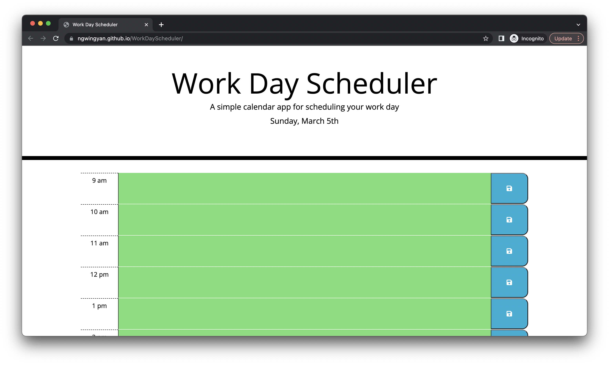
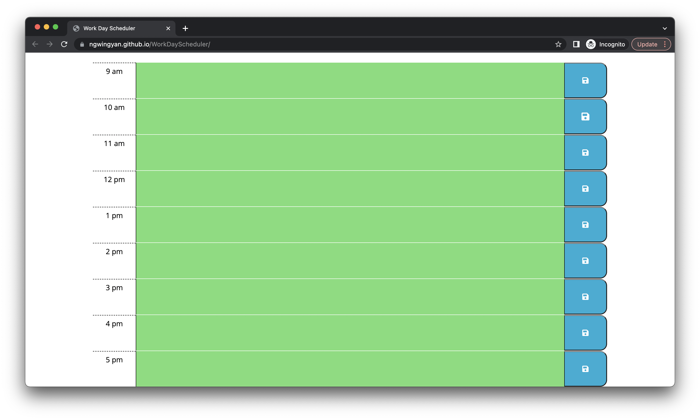
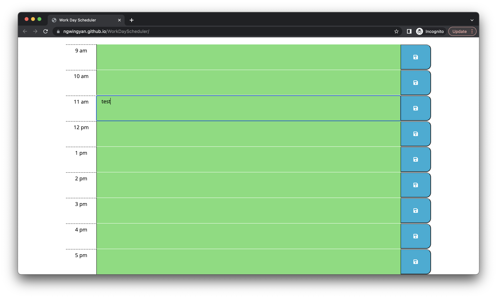
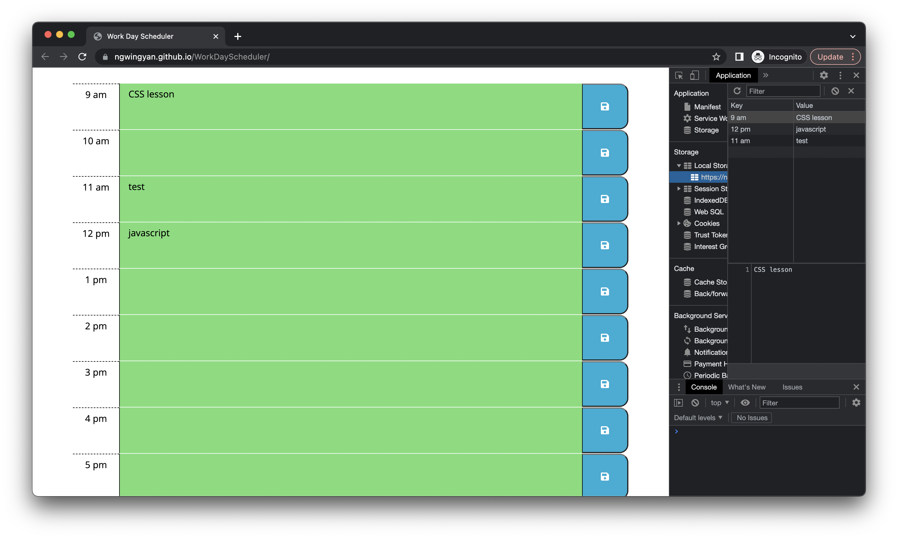

# WorkDayScheduler

## Description

Create a simple calendar application that allows a user to save events for each hour of the day by modifying starter code. This app will run in the browser and feature dynamically updated HTML and CSS powered by jQuery.
 
## Usage

- Start of page with current date display using moment.js
- The table is dynamically created with jquery
- end time is shown also
- future time displayed in red

- User can enter their event in the text area

- Event are saved in local storage once the button is pressed, and persistent after refresh

## Technology used
- HTML and CSS were provided in the starter code of the challenge, I tried to create the jquery code without having to manually amend too much HTML and CSS. Moment.js was also used to display the time.

## Future possible update
- Clean the page when the current day is changed
- introduce a remove button

## Link
- Repository URL - https://github.com/ngwingyan/WorkDayScheduler/
- Deployed URL - https://ngwingyan.github.io/WorkDayScheduler/

## License
- Please refer to the license in the repository.